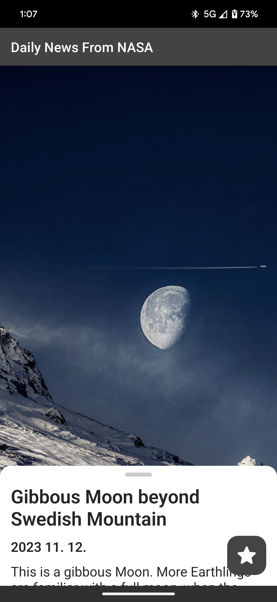
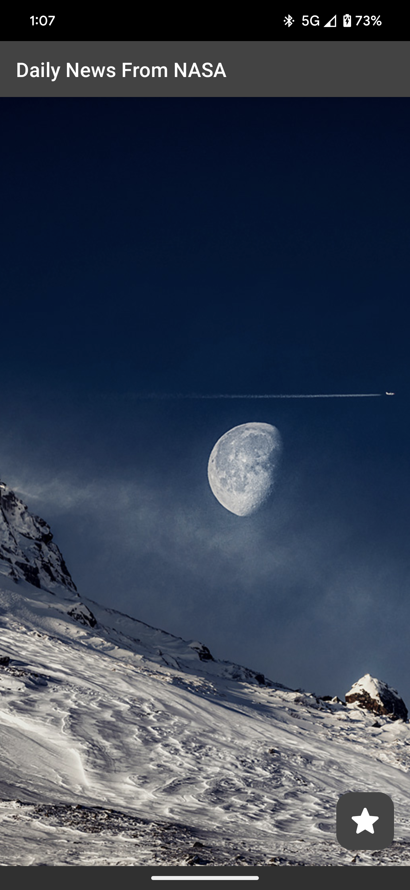
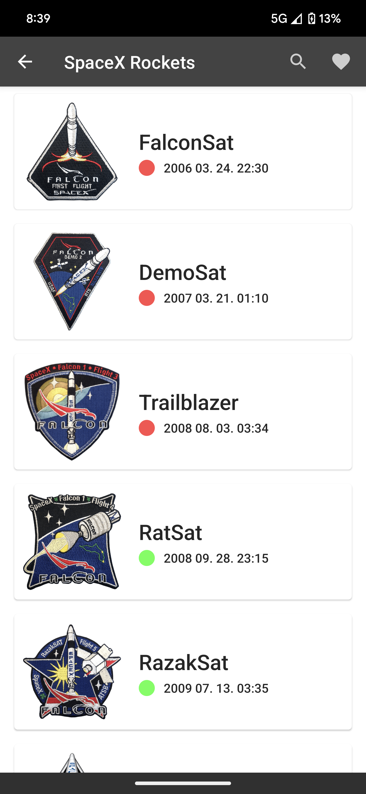
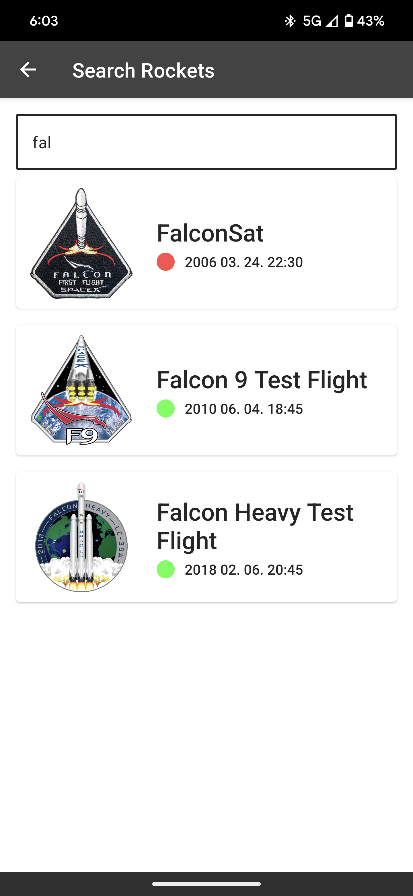
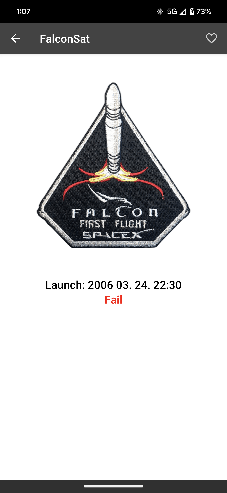
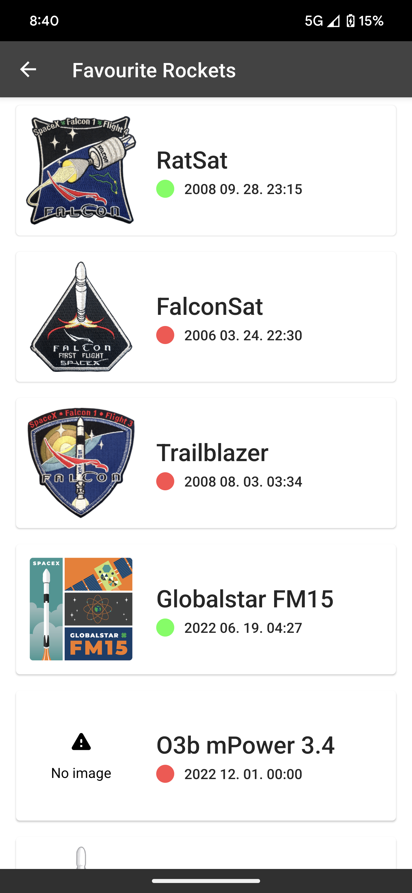

# Rocket News KMM

This application uses data from [NASA] and [SpaceX] API.

<table>
  <tr>
    <td></td>
    <td></td>
    <td></td>
  </tr>
  <tr>
    <td></td>
    <td></td>
    <td></td>
  </tr>
</table>

[NASA]: https://api.nasa.gov/planetary/apod?api_key=DEMO_KEY
[SpaceX]: https://api.spacexdata.com/v5/launches/