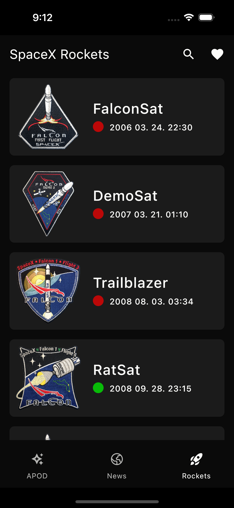

# Rocket News KMM

This application uses data from [NASA], [SpaceX] and [Spaceflight News] API.

## Screenshots
### Android
<table>
    <td></td>
    <td></td>
    <td></td>
    <td></td>
</table>

### iOS
<table>
    <td></td>
    <td></td>
    <td></td>
    <td></td>
</table>

## Before running!
- check your system with [KDoctor](https://github.com/Kotlin/kdoctor)
- install JDK 17 on your machine
- add `local.properties` file to the project root and set a path to Android SDK there

## Built with
- [Kotlin Multiplatform](https://kotlinlang.org/docs/multiplatform.html) - The Kotlin Multiplatform technology is designed to simplify the development of cross-platform projects.
- [Compose Multiplatform](https://www.jetbrains.com/lp/compose-multiplatform/) -  a modern UI framework for Kotlin that makes building performant and beautiful user interfaces easy and enjoyable.
- [SQLDelight](https://github.com/cashapp/sqldelight) - SQLDelight is an open-source library developed by Cash App (formerly Square, Inc.) for working with SQL databases in Kotlin-based Android and multi-platform applications.
- [Multiplatform Settings](https://github.com/russhwolf/multiplatform-settings) - A Kotlin Multiplatform library for saving simple key-value data.
- [Koin](https://insert-koin.io/) - The pragmatic Kotlin & Kotlin Multiplatform Dependency Injection framework.
- [Ktor](https://ktor.io/) - Ktor is a framework for building asynchronous server-side and client-side applications with ease.
- [Flow](https://github.com/Kotlin/kotlinx.coroutines) - Library support for Kotlin coroutines with multiplatform support.
- [Voyager](https://voyager.adriel.cafe/) - A multiplatform navigation library.
- [Kotlinx-datetime](https://github.com/Kotlin/kotlinx-datetime) - KotlinX multiplatform date/time library.
- [Kotlinx-serilization](https://github.com/Kotlin/kotlinx.serialization) - Kotlin multiplatform / multi-format serialization.
- [Compose Components Resources](https://mvnrepository.com/artifact/org.jetbrains.compose.components/components-resources) - Resources For Compose Multiplatform.
- [Compose Multiplatform Wizard](https://terrakok.github.io/Compose-Multiplatform-Wizard/) - Compose Multiplatform Wizard

## License
```xml
Copyright 2024 Karel Hudera

    Licensed under the Apache License, Version 2.0 (the "License");
    you may not use this file except in compliance with the License.
    You may obtain a copy of the License at

    http://www.apache.org/licenses/LICENSE-2.0

    Unless required by applicable law or agreed to in writing, software
    distributed under the License is distributed on an "AS IS" BASIS,
    WITHOUT WARRANTIES OR CONDITIONS OF ANY KIND, either express or implied.
    See the License for the specific language governing permissions and
    limitations under the License.
```  

[NASA]: https://api.nasa.gov/planetary/apod?api_key=DEMO_KEY
[SpaceX]: https://api.spacexdata.com/v5/launches/
[Spaceflight News]: https://api.spaceflightnewsapi.net/v4/articles/